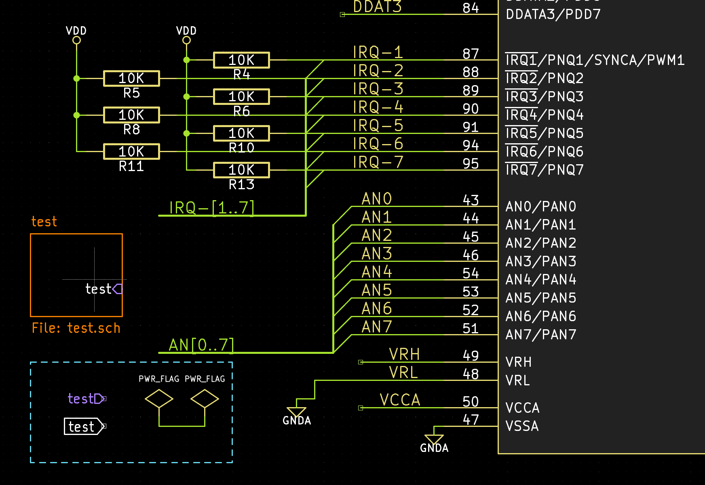
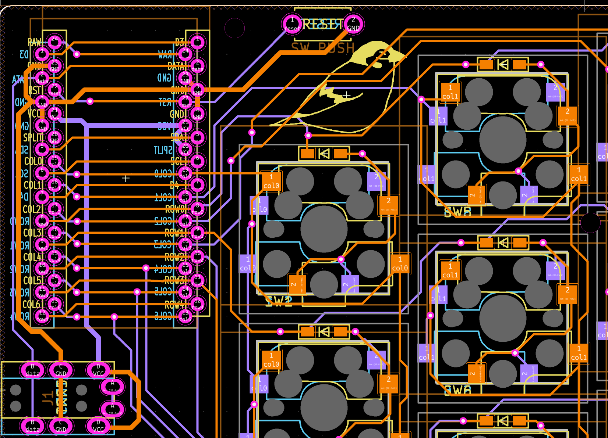

# KiCad Monokai High Contrast Theme





## how to install adn use

PCM Repository URL

```
https://raw.githubusercontent.com/74th/kicad-highcontrast-monokai-theme/main/repository.json
```

1. Install KiCad 6.0 or higher
2. Click "Plugin and Content Manager" ( or a menu of "Tools" -> "Plugin and Content Manager" )
3. Click "Manage" button.
4. Click Plus button, input `https://raw.githubusercontent.com/74th/kicad-highcontrast-monokai-theme/main/repository.json` and click save button.
5. Select package name pulldown.
6. Select "Color Themes" tab and click "Install" button of "Monokai High Contrast" card.
7. Click "Apply Changes" and "Close".
8. Open "Schematic Editor" or "PCB Editor" and open preference.
9. Select "Color" row and change theme pulldown to "Monokai High Contrast".

## License

- create_repository.py: Creative Commons Zero v1.0 Universal (from https://github.com/pointhi/kicad-color-schemes/)
- [monokai-high-contrast/](monokai-high-contrast/): MIT
